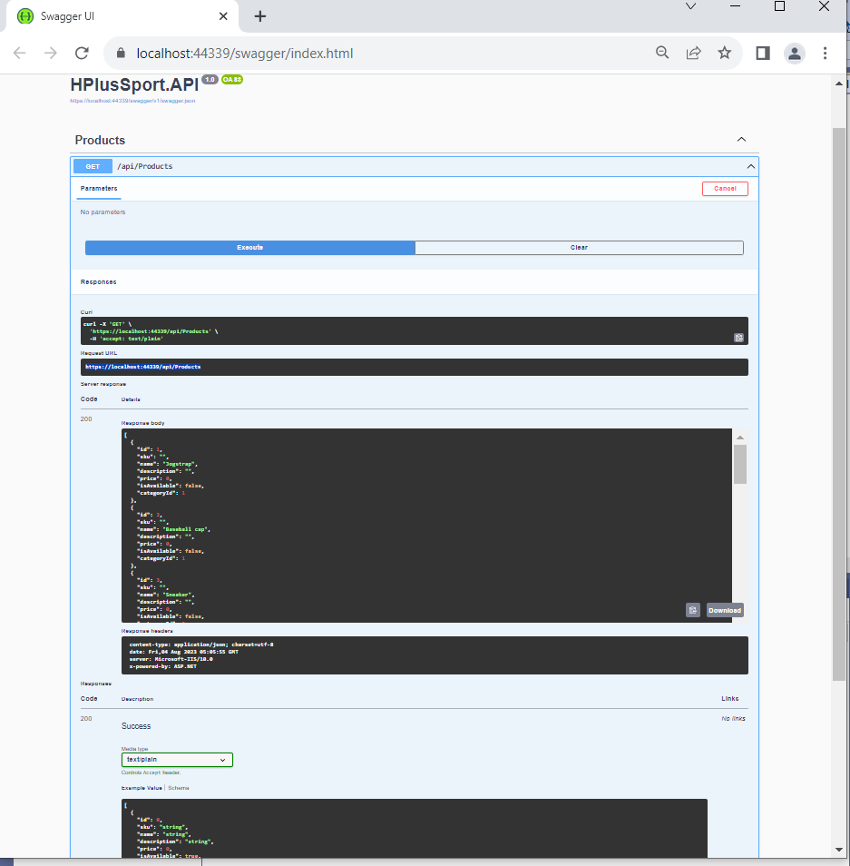
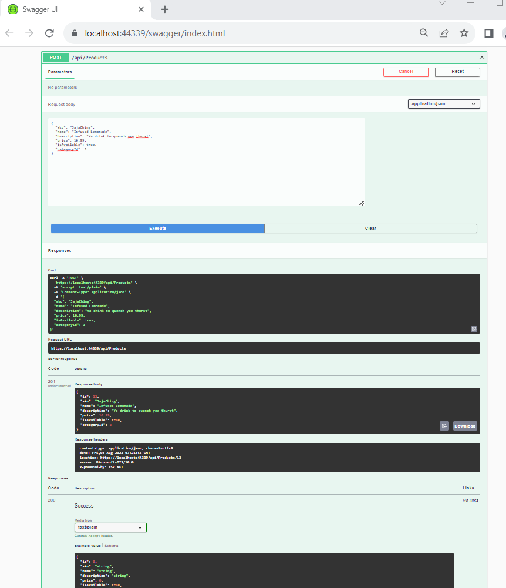

# Building Web APIs with ASP.NET Core in .NET 

*Development environment: Visual Studio 2022*

*Language: C-Sharp*

*References: LinkedIn Learning by Christian Wenz* 

**REST with HTTP Methods (CRUD)**

| HTTP Methods  | Function  |
|---|---|
| GET  | Read data  |
| POST  | Create new data  |
| PUT  | Update existing data  |
| DELETE  | Delete existing data |

**Note** 

`modelBuilder.UseInMemoryDatabase` is implemented.  Data is flushed when program terminated.

### Runtime output

The **GET** method retrieves all products.

 

The **POST** method creates a new product.

### Additional References:

[Hshopsport](https://hplussport.com/shop/)

